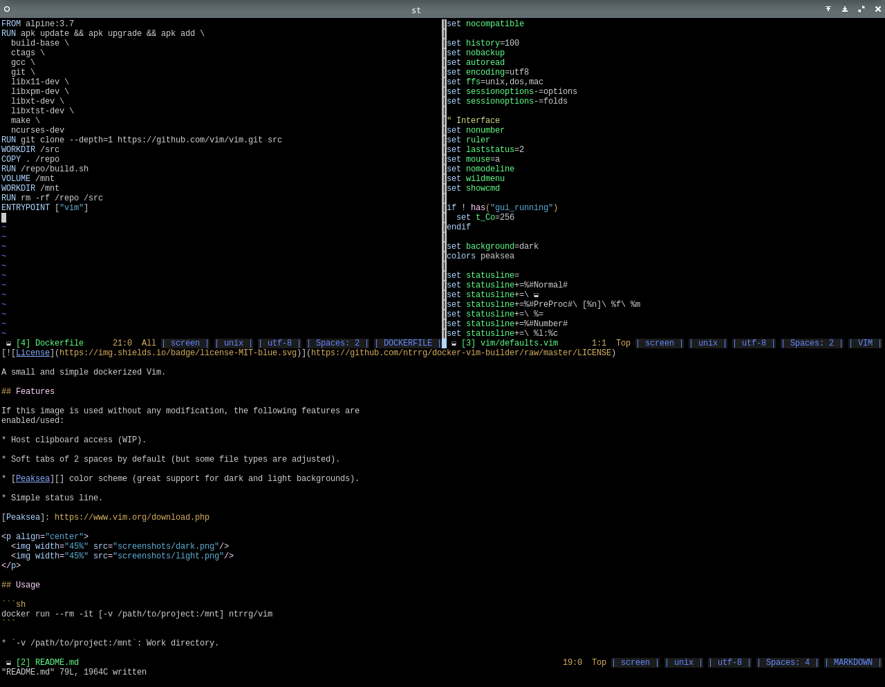
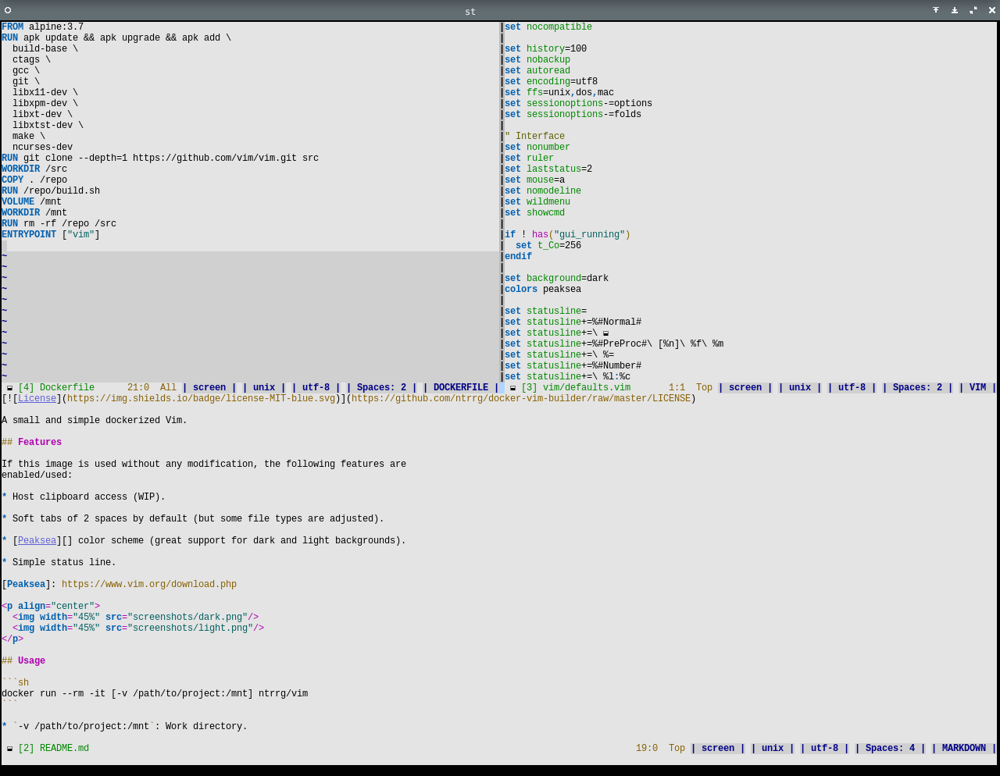

[](https://github.com/ntrrg/docker-vim-builder/raw/master/LICENSE)

A small and simple dockerized Vim.

## Features

If this image is used without any modification, the following features are
enabled/used:

* Host clipboard access (WIP).

* Soft tabs of 2 spaces by default (but some file types are adjusted).

* [Peaksea][] color scheme (great support for dark and light backgrounds).

* Simple status line.

[Peaksea]: https://www.vim.org/download.php

<p align="center">
  
  
</p>

## Usage

```sh
docker run --rm -it [-v /path/to/project:/mnt] ntrrg/vim
```

* `-v /path/to/project:/mnt`: Work directory.

## Customize

The Vim build stage may be customized, there are two variables in
[build.sh](build.sh):

* `MODS="yes|no"`: Enable/Disable modification, if `no` is given, just build and
  use Vim as default. (default: `yes`)

* `FLAGS="BUILD_FLAGS"`: Custom building flags. (default: `--with-features=huge`)

Since all the build is controlled by this script, it is easy to add custom
features like Python or Ruby support, or download and install any plugin.

## Acknowledgment

Working on this project I use/used:

* [Debian](https://www.debian.org/)

* [XFCE](https://xfce.org/)

* [Vim](https://www.vim.org/)

* [Chrome](https://www.google.com/chrome/browser/desktop/index.html)

* [st](https://st.suckless.org/)

* [Zsh](http://www.zsh.org/)

* [GNU Screen](https://www.gnu.org/software/screen)

* [Git](https://git-scm.com/)

* [EditorConfig](http://editorconfig.org/)

* [Docker](https://docker.com)

* [Github](https://github.com)

* [Termux](https://termux.com)

**Vim Team.** *download: vim online.* https://www.vim.org/download.php

**Pan Shizhu.** *peaksea* https://www.vim.org/scripts/script.php?script_id=760

**Eugene Yaremenko.** *"dockerized" Vim.* https://github.com/JAremko/alpine-vim

